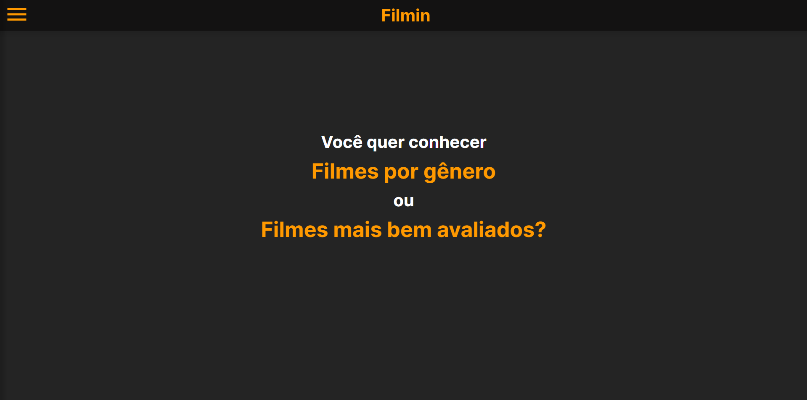

# Filmin

## 🎬sobre

O Filmin é uma aplicação que oferece recomendações de filmes aos usuários, permitindo escolher entre as opções mais bem avaliadas ou por gênero.

[Link](https://filmin.netlify.app/) do projeto

## ⚙Tecnologias

- React.js
- React Router Dom
- Vite.js
- [MoviesVerse API](https://rapidapi.com/Murad123/api/moviesverse1)

## 📃Licença
Esse projeto está sob a licença MIT. Acesse esse [link](https://opensource.org/license/mit) para saber mais.

Feito por Lucas Teixeira :)
